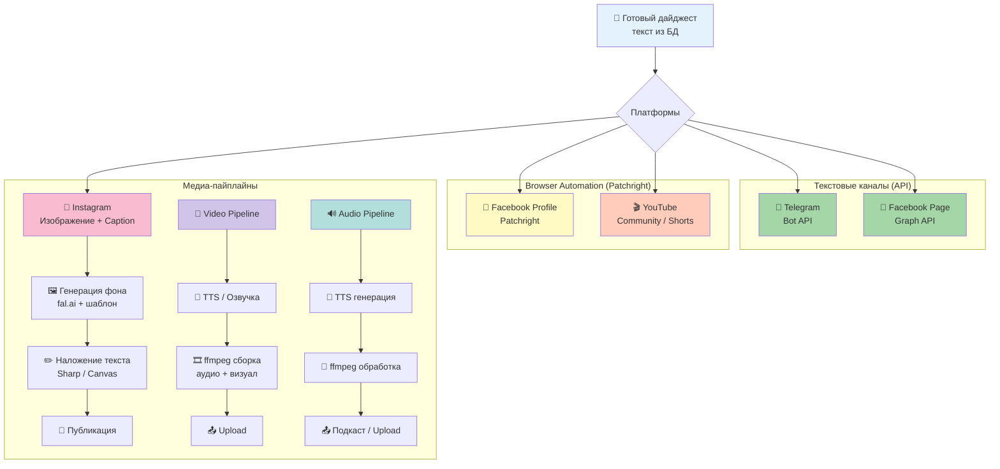
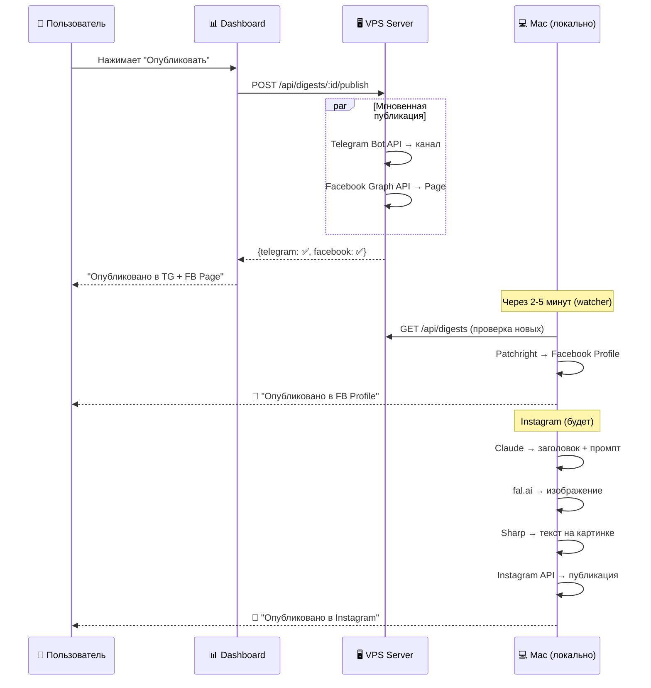

# Distribution — Мультиплатформенная дистрибуция контента

Этот раздел объединяет все пайплайны дистрибуции дайджестов в социальные сети.

## Архитектура



## Пайплайны

### 1. Текстовые каналы (работают)

| Канал | Метод | Статус |
|-------|-------|--------|
| Telegram (@alexkrol) | Bot API, авто-разбивка >4096 символов | ✅ Работает |
| Facebook Page (Alex Krol) | Graph API, Page Access Token | ✅ Работает |
| Facebook Profile | Patchright, отдельный Chromium | ✅ Тестируется |

### 2. Instagram Pipeline (в разработке)

Генерация уникального изображения + публикация.

**Этапы:** Claude → промпт + заголовок → fal.ai (Recraft V3) → Sharp (текст) → Instagram API

**Подробнее:** [instagram/README.md](../instagram/README.md)

### 3. Video Pipeline (планируется)

Генерация коротких видео из дайджеста для YouTube Shorts / Reels / TikTok.

**Концепция:**
- TTS озвучка текста (голос, интонация)
- Визуальный ряд: слайды с ключевыми тезисами + фоновые изображения
- Сборка через ffmpeg (локально)
- Длительность: 60-90 секунд

**Подробнее:** [video/README.md](video/README.md)

### 4. Audio Pipeline (планируется)

Аудиоверсия дайджеста для подкастов.

**Концепция:**
- TTS озвучка полного текста дайджеста
- Музыкальная подложка (intro/outro)
- Сборка через ffmpeg
- Публикация: подкаст-платформы, Telegram voice

**Подробнее:** [audio/README.md](audio/README.md)

## Последовательность публикации



## Общие компоненты

| Компонент | Где | Для чего |
|-----------|-----|----------|
| fal.ai | Облако | Генерация изображений |
| Sharp | Локально (Mac/VPS) | Обработка изображений, наложение текста |
| ffmpeg | Локально (Mac) | Сборка видео и аудио |
| Patchright | Локально (Mac) | Browser automation для FB/Instagram/YouTube |
| Claude API | Облако | Генерация промптов, заголовков, caption |

## Структура папок

```
distribution/
├── README.md          # Этот файл
├── video/             # Video Pipeline
│   └── README.md
└── audio/             # Audio Pipeline
    └── README.md

instagram/             # Instagram Pipeline (отдельно, т.к. уже развёрнут)
├── README.md
├── templates/
├── output/
├── src/
└── fonts/
```
